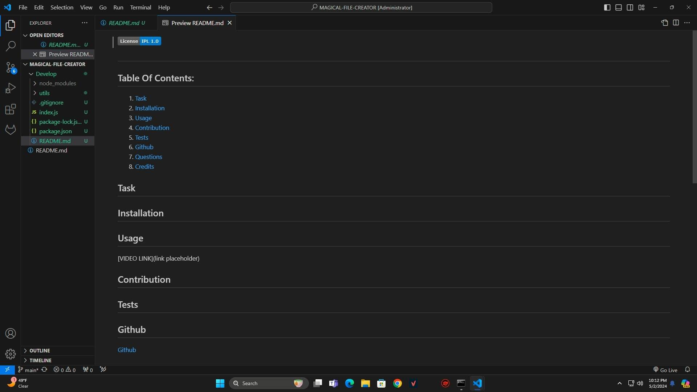

## 

## Table Of Contents:

1. [Task](#task)
2. [Installation](#installation)
3. [Usage](#usage)
4. [Contribution](#contribution)
5. [Tests](#tests)
6. [Github](#github)
7. [Questions](#questions)
8. [Credits](#credits)

## Task

## Installation 

## Usage 

[VIDEO LINK](https://drive.google.com/file/d/1Me2qdchY4jHrJURbwaRCUr9r2B_fes7t/view?usp=sharing)

## Contribution

## Tests

## Github

[Github](https://github.com/Dfyerman?tab=repositories)

## Questions

Please contact me at !

## Credits

© 2024 edX Boot Camps LLC. Confidential and Proprietary. All Rights Reserved.

